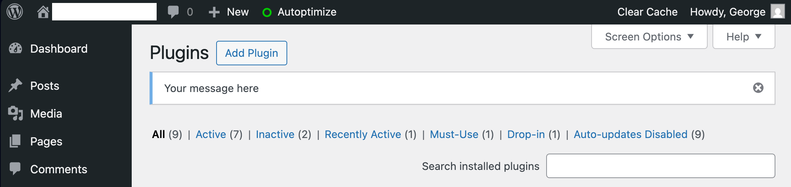

# CLI Dashboard Notice README (v1.2.0)

This document provides instructions for installing, configuring, and using the **CLI Dashboard Notice** Must-Use plugin for WordPress. This tool enables you to add, update, and delete temporary admin dashboard notices entirely via WP‑CLI commands, without further file edits.



---

## Table of Contents

* [Prerequisites](#prerequisites)
* [Installation](#installation)
* [Usage](#usage)

  * [`wp notice add`](#wp-notice-add)
  * [`wp notice update`](#wp-notice-update)
  * [`wp notice delete`](#wp-notice-delete)
* [Examples](#examples)
* [Troubleshooting](#troubleshooting)
* [Advanced Customizations](#advanced-customizations)

---

## Prerequisites

* A WordPress installation running **6.0** or later.
* WP‑CLI installed and available in your server’s `$PATH`.
* File system access to your WordPress root (SSH or similar).
* (Optional) SELinux on AlmaLinux: ability to run `restorecon`.

---

## Installation

1. **SSH into your server** and navigate to the WordPress root directory:

   ```bash
   cd /home/nginx/domains/yourdomain.com/public   # adjust to your WordPress root
   ```

2. **Create the `mu-plugins` directory** (if it doesn’t exist):

   ```bash
   mkdir -p wp-content/mu-plugins
   ```

3. **Install the MU-plugin** by creating `cli-notice.php`:

```bash
wget -O wp-content/mu-plugins/cli-notice.php https://github.com/centminmod/centminmod-mu-plugins/raw/refs/heads/master/mu-plugins/cli-notice.php
chown nginx:nginx wp-content/mu-plugins/cli-notice.php
chmod 644 wp-content/mu-plugins/cli-notice.php
```

4. **(SELinux only)** If you’re on AlmaLinux with SELinux enforcing, run:

   ```bash
   restorecon -Rv wp-content/mu-plugins
   ```

That’s it! The plugin is active automatically.

---

## Usage

Once installed, you can manage dashboard notices using the custom `wp notice` commands.

### `wp notice add`

**Syntax:**

```bash
wp notice add "Your message here"
```
```bash
wp notice add "Your message here"
Success: Added 'temp_cli_dashboard_notice' option.
Success: Updated 'temp_cli_dashboard_notice_type' option.
Success: Notice added.
```

* Creates the `temp_cli_dashboard_notice` option.
* Displays a warning-style, dismissible banner to all users with `manage_options` capability.
* Accepts an optional `--type=<type>` flag to set the notice style: one of `info`, `success`, `warning`, or `error` (defaults to `warning`). This controls the CSS class and visual color of the banner.
* Accepts an optional `--expires=<YYYY-MM-DD HH:MM:SS>` flag to auto-expire the notice at the specified timestamp.
* If the option already exists, the command will exit without error.

### `wp notice update`

**Syntax:**

```bash
wp notice update "Updated message text"
```
```bash
wp notice update "Updated message text"
Success: Updated 'temp_cli_dashboard_notice' option.
Success: Value passed for 'temp_cli_dashboard_notice_type' option is unchanged.
Warning: Could not delete 'temp_cli_dashboard_notice_expires' option. Does it exist?
Success: Notice updated.
```

* Updates the existing notice option with new content (and flags).
* If the option does not exist, the command will exit without error.

### `wp notice delete`

**Syntax:**

```bash
wp notice delete
```
```bash
wp notice delete
Success: Deleted 'temp_cli_dashboard_notice' option.
Success: Deleted 'temp_cli_dashboard_notice' option.
Success: Deleted 'temp_cli_dashboard_notice_type' option.
Success: Deleted 'temp_cli_dashboard_notice_type' option.
Success: Notice removal complete.
```

* Deletes the `temp_cli_dashboard_notice` option and related type/expiry options.
* Removes the banner for all admins.

---

## Examples

```bash
# Add a new success notice expiring tomorrow
wp notice add "🎉 Deployment complete" --type=success --expires="2025-06-17 00:00:00"

# Update the message only
wp notice update "🔄 Re-running migration"

# Remove the notice when complete
wp notice delete
```

---

## Troubleshooting

* **No banner appears:**

  * Ensure you have `manage_options` capability (only admins).
  * Verify the option exists: `wp option get temp_cli_dashboard_notice`.
  * Check browser console for JS dismiss errors.
* **500 or 404 in wp-admin:**

  * On SELinux systems, reapply contexts:

    ```bash
    restorecon -Rv wp-content/mu-plugins
    ```
* **Message contains HTML sanitized:** WordPress core sanitizes output via `wp_kses_post()`.
  To include limited HTML, wrap markup in appropriate tags and ensure it’s allowed by `post` context.

---

## Advanced Customizations

These techniques let you extend the CLI notice system beyond the default warning banner:

* **Custom Hooks:** Extend the MU-plugin to hook into other admin actions (e.g., `admin_footer`, `network_admin_notices`).
* **Script Integration:** Automate `wp notice` commands in CI/CD pipelines, cron jobs, or Ansible playbooks.
* **Multisite Support:** Prefix option names per site using `get_current_blog_id()` (e.g., `temp_cli_dashboard_notice_{$blog_id}`).

