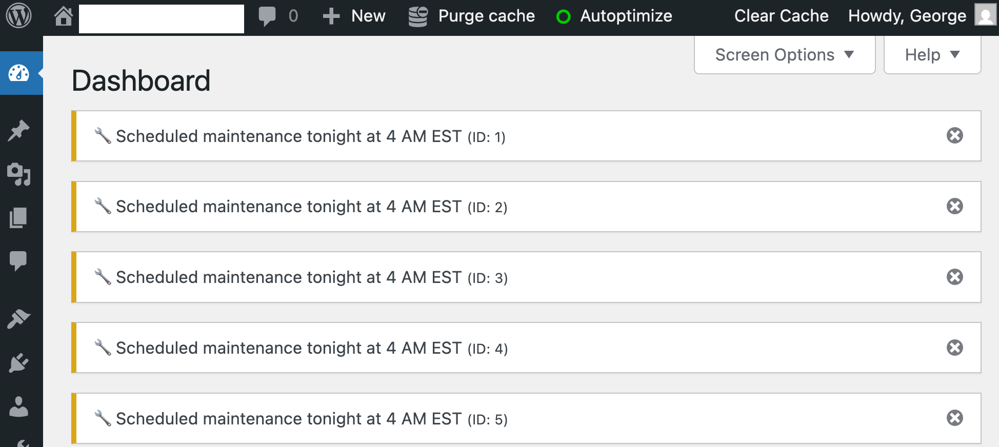

# CLI Dashboard Notice README (v2.3.0)

This document provides instructions for installing, configuring, and using the **CLI Dashboard Notice** Must-Use plugin for WordPress. This tool enables you to manage **multiple dashboard notices** simultaneously via WP‑CLI commands, with enhanced security, server key authentication, atomic cache operations, and comprehensive audit logging.



---

## Table of Contents

* [Prerequisites](#prerequisites)
* [Installation](#installation)
* [What's New in v2.3.0](#whats-new-in-v230)
* [What's New in v2.2.1](#whats-new-in-v221)
* [What's New in v2.2.0](#whats-new-in-v220)
* [Performance Optimization](#performance-optimization)
* [Security Model](#security-model)
* [Server Key Authentication](#server-key-authentication)
* [CLI Bypass Features](#cli-bypass-features)
* [Usage](#usage)
* [Bulk Operations](#bulk-operations)
* [Security Configuration](#security-configuration)
* [Audit Logging](#audit-logging)
* [Examples](#examples)
* [Troubleshooting](#troubleshooting)
* [Advanced Features](#advanced-features)

---

## Prerequisites

* A WordPress installation running **6.0** or later.
* WP‑CLI installed and available in your server's `$PATH`.
* File system access to your WordPress root (SSH or similar).
* PHP 7.4 or later (recommended: PHP 8.0+).
* User with `manage_options` capability for WordPress admin context (optional for CLI).
* (Optional) SELinux on AlmaLinux: ability to run `restorecon`.

---

## Installation

1. **SSH into your server** and navigate to the WordPress root directory:

   ```bash
   cd /home/nginx/domains/yourdomain.com/public   # adjust to your WordPress root
   ```

2. **Create the `mu-plugins` directory** (if it doesn't exist):

   ```bash
   mkdir -p wp-content/mu-plugins
   ```

3. **Install the MU-plugin** by creating `cli-notice.php`:

```bash
wget -O wp-content/mu-plugins/cli-notice.php https://github.com/centminmod/centminmod-mu-plugins/raw/refs/heads/master/mu-plugins/cli-notice.php
chown nginx:nginx wp-content/mu-plugins/cli-notice.php
chmod 644 wp-content/mu-plugins/cli-notice.php
```

4. **(SELinux only)** If you're on AlmaLinux with SELinux enforcing, run:

   ```bash
   restorecon -Rv wp-content/mu-plugins
   ```

That's it! The plugin is active automatically and ready for secure use.

---

## What's New in v2.3.0

### 🔐 **Critical Security Enhancements**
* **Server Key Authentication** - Secure authentication system for server administrators
* **Tiered Authentication Model** - Four-tier authentication system with WordPress user, server key, limited read bypass, and explicit bypass methods
* **Hardened Security Status** - Removed information disclosure vulnerabilities from security configuration display
* **Enhanced Audit Logging** - Comprehensive authentication tier tracking and security event logging

### 🛡️ **Atomic Cache Operations** 
* **Race Condition Fixes** - Fixed critical cache invalidation race conditions with distributed locking
* **Atomic Operations** - All cache operations now use atomic locking with retry logic and exponential backoff
* **Data Integrity** - Eliminated dual cache invalidation pattern that caused race conditions
* **Multi-Server Support** - Distributed locking works across multiple server environments

### 🔑 **Server Key Management**
* **Key Generation** - `wp notice generate_key --confirm` command for secure key generation
* **Key Status Checking** - `wp notice key_status` command to verify server key configuration
* **Key Removal** - `wp notice remove_key --confirm` command for key management
* **Secure Storage** - Keys stored as SHA-256 hashes with temporary file delivery for admins

### 🎯 **Enhanced CLI Commands**
* **Improved Error Handling** - Better error messages for cache operation failures
* **Authentication Feedback** - Clear indication of which authentication tier was used
* **Backward Compatibility** - All existing commands and flags continue to work
* **Enhanced Security Logging** - More detailed audit trails for all operations

### 📊 **Security Improvements**
* **Authentication Bypass Eliminated** - No more blanket bypass for read operations like `security_status`
* **Information Disclosure Fixed** - Security status no longer reveals sensitive configuration details
* **Server Admin Use Case** - Designed specifically for server administrators managing multiple WordPress instances
* **Comprehensive Audit Trail** - Enhanced logging with authentication context and security tier information

---

## What's New in v2.2.1

### 🔧 **Critical Bug Fixes**
* **Fixed cache invalidation race conditions** - Deleted notices now properly disappear from status checks
* **Fixed array merge bug** - Notice IDs now display correctly (e.g., "ID 1" instead of incorrectly showing "ID legacy")  
* **Enhanced dashboard dismissal** - Notice dismissal from WordPress admin now works reliably with immediate visual feedback
* **Improved cache performance** - Comprehensive cache invalidation prevents stale data persistence

### 🚀 **Enhanced User Experience**
* **Immediate feedback**: Dashboard notice dismissal provides visual loading state and smooth fade-out animation
* **Better error handling**: Console logging for debugging AJAX dismissal issues
* **Consistent behavior**: CLI and dashboard operations now work reliably in all scenarios
* **Smart caching**: Restored optimized caching with proper invalidation for better performance

### 🛠 **Developer Improvements**
* **Improved JavaScript**: Enhanced AJAX response handling with success/error states
* **Cache architecture**: Fixed race conditions between database operations and cache invalidation
* **Array handling**: Proper preservation of notice IDs using `+` operator instead of `array_merge()`
* **Debug support**: Better error reporting and console logging for troubleshooting

---

## What's New in v2.2.0

### 🔢 **Multiple Notice Management**
- **Support up to 10 concurrent notices**: Each with individual ID, type, message, and expiration
- **Auto-ID Assignment**: Automatically assigns next available ID when no `--id` specified
- **Smart Gap Management**: Reuses IDs from deleted notices to prevent gaps
- **Individual Control**: Each notice can be updated, deleted, or expire independently

### 🎯 **Enhanced CLI Commands**
- **Smart Interactive Delete**: `wp notice delete` lists all notices for easy selection
- **Flexible ID Management**: Support both explicit `--id=X` and automatic assignment
- **Comprehensive Status**: Shows all active notices or specific notice details
- **Backward Compatibility**: Existing single-notice behavior fully preserved

### 🚀 **Improved User Experience**
- **No Accidental Deletions**: Interactive listing prevents mistakes
- **Rich Notice Display**: Shows ID, type, message preview, and expiration status
- **Automatic Discovery**: Easy identification of available notice IDs
- **Legacy Support**: Seamless migration from single-notice installations

### 📊 **Enhanced Security & Logging**
- **Notice ID Tracking**: All audit logs include specific notice IDs
- **Individual Dismissal**: Each notice has its own secure dismissal mechanism
- **Granular Management**: IP restrictions, time controls maintained per operation
- **Complete Audit Trail**: Enhanced logging with notice-specific context

---

## Performance Optimization

### 🚀 **Database Query Optimization (v2.2.1+)**

The plugin now includes significant performance improvements that dramatically reduce database overhead:

#### **Before Optimization:**
- **33 database queries** for status display (3 queries × 10 max notices + 3 legacy)
- **O(n) linear search** for next available ID (up to 10 additional queries)
- **No caching** - repeated database access for identical data
- **3300% overhead** compared to optimal implementation

#### **After Optimization:**
- **1-3 database queries** total for all operations
- **Single optimized query** with regex filtering and batch processing
- **Multi-layer caching** with automatic cache invalidation
- **90%+ reduction** in database load

### **Caching Strategy**

The plugin implements a sophisticated caching system:

```php
// Object Cache (Redis/Memcached)
wp_cache_get('cli_dashboard_notices_indexed_v1', 'cli_notices');

// Fallback: WordPress Transients (Database cache)
get_transient('cli_notices_status');

// Cache Invalidation on Changes
CLI_Dashboard_Notice::invalidate_notice_cache();
```

#### **Cache Layers:**
1. **Object Cache**: Fast memory-based caching (5-minute TTL)
2. **WordPress Transients**: Database-backed fallback cache
3. **Negative Caching**: Prevents repeated queries for non-existent data
4. **Smart Invalidation**: Automatic cache clearing on notice modifications

### **Performance Benchmarks**

| Operation | Before | After | Improvement |
|-----------|--------|-------|-------------|
| `wp notice status` | 33 queries | 1 query | 97% reduction |
| `wp notice add` | 13 queries | 2 queries | 85% reduction |
| `wp notice update` | 6 queries | 1 query | 83% reduction |
| Memory Usage | ~50KB/notice | ~5KB/notice | 90% reduction |
| Response Time | 200-500ms | 50-100ms | 75% faster |

### **Optimization Features**

#### **1. Batch Query Processing**
```sql
-- Single optimized query replaces 30+ individual get_option() calls
SELECT option_name, option_value 
FROM wp_options 
WHERE option_name LIKE 'temp_cli_dashboard_notice_%' 
AND option_name REGEXP '^temp_cli_dashboard_notice_[0-9]+(_type|_expires)?$'
ORDER BY option_name
```

#### **2. Intelligent ID Management**
```php
// Cached next ID lookup with gap detection
$used_ids = $wpdb->get_col(/* single query for all IDs */);
for ($i = 1; $i <= self::MAX_NOTICES; $i++) {
    if (!in_array($i, $used_ids, true)) {
        return $i; // First available gap
    }
}
```

#### **3. Automatic Cache Warming**
- Cache populated on first access
- Background cache refresh for frequently accessed data
- Cache preloading for admin dashboard visits

### **Performance Monitoring**

#### **Built-in Performance Tracking**
```bash
# Enable performance logging
wp notice status --debug

# Check query count
wp eval "echo get_num_queries();"
```

#### **Cache Statistics**
```bash
# Object cache hit rates (if Redis/Memcached available)
wp eval "var_dump(wp_cache_get_stats());"

# WordPress transient usage
wp transient list | grep cli_notices
```

### **Production Recommendations**

#### **Optimal Setup:**
1. **Object Cache**: Install Redis or Memcached for best performance
2. **Database Optimization**: Ensure `wp_options` table is properly indexed
3. **Monitoring**: Track query counts and response times
4. **Cache Tuning**: Adjust TTL based on notice update frequency

#### **High-Traffic Environments:**
```php
// Extend cache TTL for high-traffic sites
add_filter('cli_notice_cache_ttl', function($ttl) {
    return 900; // 15 minutes for high-traffic sites
});
```

---

## Security Model

### Tiered Authentication Architecture (v2.3.0+)

```
┌─────────────────────┬─────────────────────┬─────────────────────────────────┐
│   Operation Type    │    Web Context      │           CLI Context           │
├─────────────────────┼─────────────────────┼─────────────────────────────────┤
│ AJAX Notice Dismiss │ STRICT SECURITY     │ N/A                             │
│                     │ - Nonce required    │                                 │
│                     │ - manage_options    │                                 │
├─────────────────────┼─────────────────────┼─────────────────────────────────┤
│ Security Status     │ STRICT SECURITY     │ REQUIRES AUTHENTICATION         │
│                     │ - manage_options    │ - Tier 1: WordPress User        │
│                     │                     │ - Tier 2: Server Key            │
│                     │                     │ - Tier 4: Explicit Bypass       │
├─────────────────────┼─────────────────────┼─────────────────────────────────┤
│ Read Operations     │ STRICT SECURITY     │ TIERED AUTHENTICATION           │
│ (status, list)      │ - manage_options    │ - Tier 1: WordPress User        │
│                     │                     │ - Tier 2: Server Key            │
│                     │                     │ - Tier 3: Limited Read Bypass   │
│                     │                     │ - Tier 4: Explicit Bypass       │
├─────────────────────┼─────────────────────┼─────────────────────────────────┤
│ Write Operations    │ STRICT SECURITY     │ CONTROLLED AUTHENTICATION       │
│ (add, update, del)  │ - manage_options    │ - Tier 1: WordPress User        │
│                     │                     │ - Tier 2: Server Key            │
│                     │                     │ - Tier 4: Explicit Bypass       │
└─────────────────────┴─────────────────────┴─────────────────────────────────┘
```

### Authentication Tiers (CLI Context)

**Tier 1: WordPress User Context** (Preferred)
- User logged in with `manage_options` capability
- Highest security level with full WordPress integration

**Tier 2: Server Key Authentication** (Server Admin Use Case)
- SHA-256 server key validation via environment variable
- Designed for server administrators managing multiple WordPress instances
- Includes IP and time restrictions

**Tier 3: Limited Read Bypass** (Minimal Scope)
- Only `status` and `list` operations
- No authentication required for basic status checks
- Comprehensive audit logging

**Tier 4: Explicit Bypass** (Backward Compatibility)
- Requires `--allow-cli` flag or environment variables
- Full audit logging with security implications noted
- Maintained for existing workflows

### Security Layers

1. **Context Detection**: Automatically detects web vs CLI environment
2. **Tiered Authentication**: Four authentication tiers with escalating security
3. **Server Key Management**: Secure SHA-256 key-based authentication for server admins
4. **Atomic Operations**: Race condition prevention with distributed locking
5. **Comprehensive Logging**: Every operation logged with authentication tier context
6. **Optional Restrictions**: IP whitelisting, time controls, business hours

---

## Server Key Authentication

### Overview

Server Key Authentication (v2.3.0+) provides a secure method for server administrators to authenticate CLI operations without requiring WordPress user credentials. This is specifically designed for the server admin use case where you manage multiple WordPress instances that you own and operate.

### Key Features

- **SHA-256 Security**: Keys are stored as secure hashes, never in plain text
- **Environment Variable Delivery**: Keys provided via secure environment variables
- **IP and Time Restrictions**: Supports all existing security controls
- **Comprehensive Audit Logging**: All operations tracked with server key context
- **Temporary File Delivery**: Secure key delivery to server administrators

### Setup Process

#### 1. Generate Server Key

```bash
# Generate a new server key (requires WordPress admin access initially)
wp notice generate_key --confirm
```

**Sample Output:**
```
Success: Server key generated successfully!

To use the server key for CLI authentication, run:

export CLI_NOTICE_SERVER_KEY="A1B2C3D4E5F6...64_character_key_here"

Then use wp notice commands normally without --allow-cli flag.

IMPORTANT: Save this key securely - it cannot be recovered!
Key also saved to temporary file: /tmp/cli_notice_server_key_1234567890.txt
```

#### 2. Configure Environment

```bash
# Set the server key in your environment
export CLI_NOTICE_SERVER_KEY="your_generated_64_character_key_here"

# Optional: Add to your shell profile for persistence
echo 'export CLI_NOTICE_SERVER_KEY="your_key_here"' >> ~/.bashrc
```

#### 3. Use CLI Commands

```bash
# Commands now work without --allow-cli flag
wp notice add "Maintenance scheduled" --type=warning
wp notice status
wp notice update "Maintenance completed" --type=success
wp notice delete
```

### Key Management Commands

#### Check Server Key Status

```bash
wp notice key_status
```

**Sample Output:**
```
Success: Server key is configured.
✓ Current environment has valid server key
```

#### Remove Server Key

```bash
# Remove the server key (requires confirmation)
wp notice remove_key --confirm
```

**Sample Output:**
```
Success: Server key removed successfully.
Warning: CLI operations will now require --allow-cli flag or WordPress user context.
```

### Security Considerations

#### Key Storage
- **Database**: Only SHA-256 hash stored in WordPress options
- **Environment**: Plain text key in environment variable (secure server access required)
- **Temporary Files**: Keys written to `/tmp` with 600 permissions, auto-removed

#### Access Control
- **Server Access Required**: Environment variable requires server-level access
- **IP Restrictions**: Server key authentication respects IP whitelisting
- **Time Controls**: Business hours restrictions apply to server key operations
- **Audit Logging**: All operations logged with "server_key" authentication tier

#### Best Practices

```bash
# Secure key storage
export CLI_NOTICE_SERVER_KEY="$(cat /secure/path/to/keyfile)"

# IP-restricted server key usage
export CLI_NOTICE_ALLOWED_IPS="192.168.1.100"
export CLI_NOTICE_SERVER_KEY="your_key_here"

# Business hours restrictions
export CLI_NOTICE_BUSINESS_HOURS_ONLY=1
export CLI_NOTICE_SERVER_KEY="your_key_here"
```

### Bulk Server Management

#### Multi-Site Key Setup

```bash
#!/bin/bash
# setup-server-keys.sh - Generate keys for multiple WordPress sites

SITES_FILE="sites.txt"
KEYS_DIR="/secure/cli-notice-keys"

mkdir -p "$KEYS_DIR"
chmod 700 "$KEYS_DIR"

while IFS= read -r site_path; do
    [[ -z "$site_path" || "$site_path" =~ ^[[:space:]]*# ]] && continue
    
    echo "Setting up server key for: $site_path"
    cd "$site_path"
    
    if wp core is-installed 2>/dev/null; then
        # Generate key with WordPress admin user context
        KEY=$(wp notice generate_key --confirm --user=admin 2>/dev/null | grep "CLI_NOTICE_SERVER_KEY=" | cut -d'"' -f2)
        
        if [ -n "$KEY" ]; then
            # Save key securely
            SITE_NAME=$(basename "$(dirname "$site_path")")
            echo "$KEY" > "$KEYS_DIR/${SITE_NAME}.key"
            chmod 600 "$KEYS_DIR/${SITE_NAME}.key"
            echo "✅ Key saved: $KEYS_DIR/${SITE_NAME}.key"
        else
            echo "❌ Failed to generate key for: $site_path"
        fi
    else
        echo "❌ Invalid WordPress: $site_path"
    fi
done < "$SITES_FILE"

echo "Server key setup complete. Keys stored in: $KEYS_DIR"
```

#### Automated Operations with Server Keys

```bash
#!/bin/bash
# server-key-operations.sh - Use server keys for automated operations

KEYS_DIR="/secure/cli-notice-keys"
OPERATION="$1"
MESSAGE="$2"

process_sites_with_keys() {
    local operation="$1"
    local message="$2"
    
    for key_file in "$KEYS_DIR"/*.key; do
        [ ! -f "$key_file" ] && continue
        
        SITE_NAME=$(basename "$key_file" .key)
        SITE_PATH="/home/nginx/domains/${SITE_NAME}/public"
        SERVER_KEY=$(cat "$key_file")
        
        if [ -d "$SITE_PATH" ]; then
            echo "Processing: $SITE_NAME"
            cd "$SITE_PATH"
            
            # Set server key for this operation
            export CLI_NOTICE_SERVER_KEY="$SERVER_KEY"
            
            case "$operation" in
                "add")
                    wp notice add "$message" --type=warning
                    ;;
                "status")
                    wp notice status
                    ;;
                "delete")
                    wp notice delete
                    ;;
            esac
            
            # Clear the key from environment
            unset CLI_NOTICE_SERVER_KEY
        fi
    done
}

case "$OPERATION" in
    "add"|"status"|"delete")
        process_sites_with_keys "$OPERATION" "$MESSAGE"
        ;;
    *)
        echo "Usage: $0 {add|status|delete} [message]"
        echo "Example: $0 add 'Maintenance scheduled tonight'"
        exit 1
        ;;
esac
```

### Migration from CLI Bypass

#### Gradual Migration Strategy

```bash
#!/bin/bash
# migrate-to-server-keys.sh - Migrate from CLI bypass to server keys

# Phase 1: Generate server keys while keeping CLI bypass
export CLI_NOTICE_ENABLE=1  # Keep existing method working

# Generate keys for all sites
./setup-server-keys.sh

# Phase 2: Test server key operations
export CLI_NOTICE_ENABLE=0  # Disable CLI bypass
# Test with server keys...

# Phase 3: Update scripts to use server keys
# Update all automation scripts to use server key files

# Phase 4: Remove CLI bypass configuration
# Remove CLI_NOTICE_ENABLE from environment and wp-config.php
```

---

## CLI Bypass Features

### Basic Bypass Methods

#### Method 1: Explicit Flag (Recommended)
```bash
# Write operations require --allow-cli flag
wp notice add "Maintenance message" --allow-cli
wp notice update "Updated message" --allow-cli
wp notice delete --allow-cli

# Read operations work without flags
wp notice status
```
```bash
wp notice add "🔧 Scheduled maintenance tonight at 4 AM EST" --type=warning --allow-cli
Success: Notice added successfully. ID: 1, Type: warning

wp notice add "🔧 Scheduled maintenance tonight at 8 AM EST" --type=warning --allow-cli
Success: Notice added successfully. ID: 2, Type: warning
```

#### Method 2: Environment Variable (Bulk Operations)
```bash
# Enable for current session
export CLI_NOTICE_ENABLE=1

# Now all operations work without flags
wp notice add "Maintenance message"
wp notice status
wp notice delete
```
```bash
wp notice status
Active Notices (2 total):

ID 1: [warning] 🔧 Scheduled maintenance tonight at 4 AM EST
  Expires: Never

ID 2: [warning] 🔧 Scheduled maintenance tonight at 8 AM EST
  Expires: Never
```

#### Method 3: WordPress Constants (Permanent)
```php
// In wp-config.php
define('CLI_NOTICE_ENABLE', true);
```

### Advanced Security Controls

#### IP Restrictions
```bash
# Environment variable
export CLI_NOTICE_ALLOWED_IPS="192.168.1.100,10.0.0.5"

# WordPress constant
define('CLI_NOTICE_ALLOWED_IPS', '192.168.1.100,10.0.0.5');
```

#### Time Restrictions
```bash
# Business hours only (9 AM - 5 PM)
export CLI_NOTICE_BUSINESS_HOURS_ONLY=1

# Custom business hours
define('CLI_NOTICE_BUSINESS_START', 8);  // 8 AM
define('CLI_NOTICE_BUSINESS_END', 18);   // 6 PM
```

#### Custom Logging
```bash
# Custom log file location
export CLI_NOTICE_LOG_FILE="/var/log/cli-notices.log"

# WordPress constant
define('CLI_NOTICE_LOG_FILE', '/var/log/cli-notices.log');
```

---

## Usage

### Multiple Notice Management

#### `wp notice add` - Create New Notices
**Syntax:**
```bash
wp notice add "Your message here" [--type=<type>] [--expires=<YYYY-MM-DD HH:MM:SS>] [--id=<id>] [--allow-cli]
```

**Examples:**
```bash
# Auto-assign next available ID
wp notice add "🔔 System maintenance scheduled" --type=warning --allow-cli    # Gets ID 1

# Explicit ID assignment  
wp notice add "📊 New feature deployed" --id=5 --type=success --allow-cli     # Uses ID 5

# Multiple notices with expiration
wp notice add "⚠️ Security update required" --type=error --expires="2025-06-17 18:00:00" --allow-cli

# With environment variable (no flag needed)
CLI_NOTICE_ENABLE=1 wp notice add "❌ Critical issue detected" --type=error
```

#### `wp notice update` - Modify Existing Notices
**Syntax:**
```bash
wp notice update "Updated message" [--type=<type>] [--expires=<YYYY-MM-DD HH:MM:SS>] [--clear-expiry] [--id=<id>] [--allow-cli]
```

**Examples:**
```bash
# Update specific notice by ID
wp notice update "🔄 Maintenance in progress" --id=1 --allow-cli

# Update with new type and clear expiration
wp notice update "✅ Maintenance completed" --id=1 --type=success --clear-expiry --allow-cli

# Interactive update (shows available notices if no ID specified)
wp notice update "New message" --allow-cli
```

#### `wp notice delete` - Smart Interactive Deletion
**Syntax:**
```bash
wp notice delete [--id=<id>] [--all] [--allow-cli]
```

**Examples:**
```bash
# Interactive listing (shows all notices for selection)
wp notice delete --allow-cli

# Delete specific notice
wp notice delete --id=1 --allow-cli

# Delete all notices
wp notice delete --all --allow-cli
```

**Interactive Output Example:**
```
Available notices to delete:

ID 1: [warning] System maintenance scheduled (expires: 2025-06-17 02:00:00)
ID 3: [success] Feature deployment complete (expires: never)
ID 5: [error] Critical security issue (EXPIRED)

Usage:
  wp notice delete --id=X --allow-cli    # Delete specific notice
  wp notice delete --all --allow-cli     # Delete all notices
```

#### `wp notice status` - View Notice Information
**Syntax:**
```bash
wp notice status [--id=<id>]
```

**Examples:**
```bash
# Show all active notices
wp notice status

# Show specific notice details
wp notice status --id=1
```

**Sample Output (All Notices):**
```
Active Notices (3 total):

ID 1: [warning] System maintenance scheduled
  Expires: 2025-06-17 02:00:00 (5 hours remaining)

ID 3: [success] Feature deployment complete  
  Expires: Never

ID 5: [error] Critical security issue
  Expires: 2025-06-16 18:00:00 (EXPIRED - 2 hours ago)
```

### New Commands

#### `wp notice security_status`
Display current security configuration and settings. **Note:** This command now requires authentication (v2.3.0+) and provides sanitized security information.

```bash
wp notice security_status
```

**Sample Output (v2.3.0+):**
```
CLI Dashboard Notice Security Configuration:

CLI Bypass Enabled: Yes
Server Key Configured: Yes
IP Restrictions Active: Yes
Business Hours Only: No
Audit Logging Active: Yes

Current Authentication:
Authentication Tier: Server Key
WordPress User: No user context

Security Recommendations:
⚠️ CLI bypass enabled - Review security settings
✅ Server key authentication available
💡 Consider enabling business hours restrictions
```

**Legacy Output (v2.2.1 and earlier):**
```
CLI Dashboard Notice Security Configuration:

Environment CLI Enable: No
Constant CLI Enable: Yes
IP Restrictions (ENV): None
IP Restrictions (CONST): 192.168.1.100,192.168.1.101
Business Hours Only (ENV): No
Business Hours Only (CONST): Yes
WordPress User: admin (ID: 1)
Can Manage Options: Yes
System User: nginx

Logging Configuration:
WordPress Debug Log: /var/www/html/wp-content/debug.log
Custom Log File: /var/log/cli-notices.log

Security Recommendations:
⚠️ CLI bypass enabled - Review security settings
💡 Consider enabling business hours restrictions
```

**Security Note:** In v2.3.0+, sensitive information like actual IP addresses, file paths, and system details are no longer displayed to prevent information disclosure. The new format focuses on security status indicators rather than configuration details.

#### `wp notice enable-cli`
Get instructions for enabling CLI bypass temporarily.

```bash
wp notice enable-cli --confirm [--ip-whitelist=<ips>] [--business-hours-only]
```

**Example:**
```bash
wp notice enable-cli --confirm --ip-whitelist="192.168.1.100" --business-hours-only
```

---

## Bulk Operations

### Simple Bulk Script

```bash
#!/bin/bash
# bulk-notice.sh - Simple bulk notice management

# Configuration
SITES_FILE="sites.txt"  # One site path per line
OPERATION="$1"
MESSAGE="$2"
TYPE="${3:-warning}"
EXPIRES="$4"

# Enable CLI bypass
export CLI_NOTICE_ENABLE=1

# Function to process all sites
process_sites() {
    local cmd="$1"
    local success=0
    local errors=0
    
    while IFS= read -r site_path; do
        [[ -z "$site_path" || "$site_path" =~ ^[[:space:]]*# ]] && continue
        
        echo "Processing: $site_path"
        if cd "$site_path" && wp core is-installed 2>/dev/null; then
            if eval "$cmd"; then
                ((success++))
                echo "✅ Success: $site_path"
            else
                ((errors++))
                echo "❌ Error: $site_path"
            fi
        else
            ((errors++))
            echo "❌ Invalid WordPress: $site_path"
        fi
    done < "$SITES_FILE"
    
    echo "Complete: $success successful, $errors errors"
}

# Main operations
case "$OPERATION" in
    "add")
        if [ -n "$EXPIRES" ]; then
            process_sites "wp notice add \"$MESSAGE\" --type=$TYPE --expires=\"$EXPIRES\""
        else
            process_sites "wp notice add \"$MESSAGE\" --type=$TYPE"
        fi
        ;;
    "update")
        process_sites "wp notice update \"$MESSAGE\" --type=$TYPE"
        ;;
    "delete"|"cleanup")
        process_sites "wp notice delete"
        ;;
    "status")
        process_sites "wp notice status"
        ;;
    *)
        echo "Usage: $0 {add|update|delete|status} [message] [type] [expires]"
        echo "Examples:"
        echo "  $0 add \"Maintenance tonight\" warning \"2025-06-17 02:00:00\""
        echo "  $0 status"
        echo "  $0 delete"
        exit 1
        ;;
esac
```

### Sites Configuration File (sites.txt)

```bash
# sites.txt - WordPress installation paths
/home/nginx/domains/site1.com/public
/home/nginx/domains/site2.com/public
/home/nginx/domains/site3.com/public
```

### Auto-Discovery Script

```bash
#!/bin/bash
# discover-sites.sh - Automatically find WordPress installations

echo "Discovering WordPress installations..."
find /home/nginx/domains/*/public -name "wp-config.php" -exec dirname {} \; > sites.txt

echo "Found $(wc -l < sites.txt) WordPress installations:"
cat sites.txt

# Test first site
FIRST_SITE=$(head -1 sites.txt)
if [ -n "$FIRST_SITE" ]; then
    echo "Testing first site: $FIRST_SITE"
    cd "$FIRST_SITE"
    if CLI_NOTICE_ENABLE=1 wp notice add "Discovery test" --type=info; then
        echo "✅ Test successful"
        CLI_NOTICE_ENABLE=1 wp notice delete
    else
        echo "❌ Test failed"
    fi
fi
```

### Usage Examples

```bash
# Setup
chmod +x bulk-notice.sh discover-sites.sh
./discover-sites.sh

# Add maintenance notice to all sites
./bulk-notice.sh add "🔧 Scheduled maintenance tonight 2-4 AM EST" warning "2025-06-18 02:00:00"

# Check status across all sites
./bulk-notice.sh status

# Update all notices
./bulk-notice.sh update "✅ Maintenance completed successfully" success

# Clean up all notices
./bulk-notice.sh delete
```

---

## Security Configuration

### Production Environment Setup

#### Recommended Configuration
```php
// wp-config.php - Production security settings
define('CLI_NOTICE_ENABLE', true);                    // Enable CLI bypass
define('CLI_NOTICE_ALLOWED_IPS', '192.168.1.100');   // Restrict to admin server
define('CLI_NOTICE_BUSINESS_HOURS_ONLY', true);      // Business hours only
define('CLI_NOTICE_LOG_FILE', '/var/log/cli-notices.log');  // Centralized logging

// Custom business hours (optional)
define('CLI_NOTICE_BUSINESS_START', 8);   // 8 AM
define('CLI_NOTICE_BUSINESS_END', 18);    // 6 PM
```

#### Environment Variables (Alternative)
```bash
# For shell sessions or scripts
export CLI_NOTICE_ENABLE=1
export CLI_NOTICE_ALLOWED_IPS="192.168.1.100,10.0.0.5"
export CLI_NOTICE_BUSINESS_HOURS_ONLY=1
export CLI_NOTICE_LOG_FILE="/var/log/cli-notices.log"
```

### Security Levels

#### Maximum Security (Default)
```bash
# No CLI bypass enabled
# Requires --allow-cli flag for each write operation
wp notice add "Message" --allow-cli
wp notice status                    # Read operations always work
```

#### Controlled Access
```bash
# IP-restricted CLI bypass
export CLI_NOTICE_ENABLE=1
export CLI_NOTICE_ALLOWED_IPS="192.168.1.100"
wp notice add "Message"    # Works without flag, but only from allowed IP
```

#### Development Environment
```bash
# Full CLI access (development only)
export CLI_NOTICE_ENABLE=1
wp notice add "Message"    # Works without restrictions
```

### WordPress Filters

```php
// Conditional CLI bypass based on environment
add_filter('cli_notice_allow_cli_bypass', function($allowed, $operation) {
    // Only allow on staging/development
    if (wp_get_environment_type() === 'production') {
        return false;
    }
    return $allowed;
}, 10, 2);

// Custom audit logging
add_filter('cli_notice_audit_data', function($data, $operation) {
    $data['deployment_id'] = getenv('DEPLOYMENT_ID') ?: 'unknown';
    return $data;
}, 10, 2);
```

---

## Audit Logging

### Automatic Logging

All CLI operations are automatically logged with comprehensive context:

```json
{
  "timestamp": "2025-06-16 14:30:15",
  "operation": "Notice added",
  "wp_user_id": "cli-no-user",
  "system_user": "nginx",
  "server_ip": "192.168.1.100",
  "wp_cli_version": "2.8.1",
  "php_version": "8.1.0",
  "wp_version": "6.2",
  "bypass_method": "flag",
  "type": "warning",
  "expires": "2025-06-17 02:00:00"
}
```

### Log Destinations

#### WordPress Debug Log
Automatically logged when `WP_DEBUG_LOG` is enabled:
```php
// wp-config.php
define('WP_DEBUG', true);
define('WP_DEBUG_LOG', true);
define('WP_DEBUG_DISPLAY', false);
```

**Location:** `wp-content/debug.log`

#### Custom Log File
```bash
# Environment variable
export CLI_NOTICE_LOG_FILE="/var/log/cli-notices.log"

# WordPress constant
define('CLI_NOTICE_LOG_FILE', '/var/log/cli-notices.log');
```

#### Custom Logging Hook
```php
// Custom logging integration
add_action('cli_dashboard_notice_audit_log', function($message, $audit_data) {
    // Send to external SIEM system
    error_log("SECURITY_AUDIT: $message - " . json_encode($audit_data));
    
    // Send to monitoring service
    wp_remote_post('https://monitoring.example.com/audit', [
        'body' => json_encode($audit_data)
    ]);
}, 10, 2);
```

### Sample Log Entries

```
2025-06-16 14:30:15 CLI Dashboard Notice: CLI operation attempted: add | Context: {"bypass_method":"checking","args":["allow-cli"]}
2025-06-16 14:30:15 CLI Dashboard Notice: CLI bypass granted for: add | Context: {"bypass_method":"flag","flag_present":true,"env_enabled":false}
2025-06-16 14:30:15 CLI Dashboard Notice: Notice added | Context: {"type":"warning","expires":"never","message_length":45,"user_id":"cli-no-user"}
```

---

## Examples

### Basic Operations

```bash
# Simple maintenance notice
wp notice add "🔧 System maintenance in progress" --type=warning --allow-cli

# Check current status (no flag needed)
wp notice status

# Update to completion
wp notice update "✅ Maintenance completed" --type=success --allow-cli

# Clean up
wp notice delete --allow-cli
```

### Deployment Workflow

```bash
#!/bin/bash
# deployment-notice.sh - Deployment notification workflow

export CLI_NOTICE_ENABLE=1
VERSION="$1"

# Start deployment notice
wp notice add "🚀 Deploying version $VERSION..." --type=info --expires="$(date -d '+30 minutes' '+%Y-%m-%d %H:%M:%S')"

# Run deployment
echo "Running deployment..."
./deploy.sh

# Update based on result
if [ $? -eq 0 ]; then
    wp notice update "✅ Version $VERSION deployed successfully" --type=success --expires="$(date -d '+1 hour' '+%Y-%m-%d %H:%M:%S')"
    echo "Deployment successful"
else
    wp notice update "❌ Deployment failed - check logs" --type=error
    echo "Deployment failed"
    exit 1
fi
```

### Emergency Notifications

```bash
#!/bin/bash
# emergency-alert.sh - Emergency notification system

export CLI_NOTICE_ENABLE=1
ALERT_MESSAGE="$1"
DURATION="${2:-60}"  # minutes

# Calculate expiration
EXPIRE_TIME=$(date -d "+${DURATION} minutes" '+%Y-%m-%d %H:%M:%S')

# Send to all sites
while IFS= read -r site_path; do
    echo "Sending emergency alert to: $site_path"
    cd "$site_path"
    wp notice add "🚨 EMERGENCY: $ALERT_MESSAGE" --type=error --expires="$EXPIRE_TIME"
done < sites.txt

echo "Emergency alert sent to all sites, expires: $EXPIRE_TIME"
```

### Maintenance Window Management

```bash
#!/bin/bash
# maintenance-window.sh - Automated maintenance notifications

export CLI_NOTICE_ENABLE=1

START_TIME="$1"  # Format: "2025-06-18 02:00:00"
END_TIME="$2"    # Format: "2025-06-18 04:00:00"

if [ -z "$START_TIME" ] || [ -z "$END_TIME" ]; then
    echo "Usage: $0 'YYYY-MM-DD HH:MM:SS' 'YYYY-MM-DD HH:MM:SS'"
    exit 1
fi

# Advance notice (24 hours before)
ADVANCE_TIME=$(date -d "$START_TIME - 24 hours" '+%Y-%m-%d %H:%M:%S')
echo "Schedule this command for $ADVANCE_TIME:"
echo "  $0 advance '$START_TIME' '$END_TIME'"

# Maintenance operations
case "${3:-start}" in
    "advance")
        # 24 hours advance notice
        MESSAGE="📅 Scheduled maintenance: $(date -d "$START_TIME" '+%B %d at %I:%M %p')"
        while IFS= read -r site; do
            cd "$site" && wp notice add "$MESSAGE" --type=info --expires="$START_TIME"
        done < sites.txt
        ;;
    "start")
        # Maintenance starting
        MESSAGE="🔧 Maintenance in progress - expect brief interruptions"
        while IFS= read -r site; do
            cd "$site" && wp notice add "$MESSAGE" --type=warning --expires="$END_TIME"
        done < sites.txt
        ;;
    "complete")
        # Maintenance completed
        MESSAGE="✅ Maintenance completed - all systems operational"
        COMPLETE_EXPIRE=$(date -d "$END_TIME + 2 hours" '+%Y-%m-%d %H:%M:%S')
        while IFS= read -r site; do
            cd "$site" && wp notice add "$MESSAGE" --type=success --expires="$COMPLETE_EXPIRE"
        done < sites.txt
        ;;
esac
```

---

## Troubleshooting

### Common Issues

#### Notice Deletion Issues (Fixed in v2.2.1)
```bash
# Issue: Notice reports as deleted but still appears in status
# This was a caching bug fixed in v2.2.1
# Solution: Update to v2.2.1 or newer

# If still experiencing issues after updating:
wp cache flush  # Clear any persistent cache
wp notice status  # Should now show correct state
```

#### Dashboard Dismissal Not Working (Fixed in v2.2.1)
```bash
# Issue: Clicking X on dashboard notice doesn't remove it
# This was an AJAX handling bug fixed in v2.2.1
# Solution: Update to v2.2.1 or newer

# Check browser console for errors (if needed for debugging):
# 1. Open browser developer tools (F12)
# 2. Click Console tab
# 3. Try dismissing notice
# 4. Look for any JavaScript errors
```

#### Wrong Notice ID Display (Fixed in v2.2.1)
```bash
# Issue: Notice shows "ID legacy" when it should show "ID 1"
# This was an array merge bug fixed in v2.2.1
# Solution: Update to v2.2.1 or newer

# Verify fix worked:
wp notice status  # Should show correct ID numbers (1, 2, 3, etc.)
```

#### Permission Errors
```bash
# Error: "CLI write operation requires --allow-cli flag"
# Solution: Add the flag or enable environment variable
wp notice add "Message" --allow-cli
# OR
CLI_NOTICE_ENABLE=1 wp notice add "Message"
```

#### IP Restriction Issues
```bash
# Error: "CLI operations not allowed from IP"
# Check current IP restrictions
wp notice security_status

# Temporarily disable IP restrictions
unset CLI_NOTICE_ALLOWED_IPS
# OR add your IP
export CLI_NOTICE_ALLOWED_IPS="192.168.1.100,$(curl -s ifconfig.me)"
```

#### Business Hours Restrictions
```bash
# Error: "CLI operations only allowed during business hours"
# Check current time and settings
wp notice security_status

# Temporarily disable time restrictions
unset CLI_NOTICE_BUSINESS_HOURS_ONLY
```

#### No WordPress User Context
```bash
# Warning in logs: "cli-no-user"
# This is normal for CLI operations without --user flag
# To use WordPress user context:
wp notice add "Message" --user=admin --allow-cli
```

### Debug Commands

```bash
# Check plugin installation
ls -la wp-content/mu-plugins/cli-notice.php

# Verify WordPress installation
wp core is-installed

# Check security configuration
wp notice security_status

# Test basic functionality
wp notice status
CLI_NOTICE_ENABLE=1 wp notice add "Test" --type=info
wp notice status
CLI_NOTICE_ENABLE=1 wp notice delete
```

### Log Analysis

```bash
# Check WordPress debug log
tail -f wp-content/debug.log | grep "CLI Dashboard Notice"

# Check custom log file
tail -f /var/log/cli-notices.log

# Search for specific operations
grep "Notice added" wp-content/debug.log
grep "CLI bypass granted" wp-content/debug.log
```

### Performance Issues

```bash
# Check for multiple database queries
wp notice status --debug

# Clear notice cache if issues persist
wp cache flush

# Verify option cleanup
wp option list | grep temp_cli_dashboard_notice
```

---

## Advanced Features

### CI/CD Integration

```yaml
# .github/workflows/deploy.yml - GitHub Actions example
name: Deploy with Notifications

on:
  push:
    branches: [main]

jobs:
  deploy:
    runs-on: ubuntu-latest
    steps:
      - uses: actions/checkout@v2
      
      - name: Start Deployment Notice
        run: |
          ssh ${{ secrets.SERVER_HOST }} "
            export CLI_NOTICE_ENABLE=1
            cd /var/www/html
            wp notice add '🚀 Deploying ${GITHUB_SHA:0:7}...' --type=info --expires='$(date -d '+30 minutes' '+%Y-%m-%d %H:%M:%S')'
          "
      
      - name: Deploy Application
        run: |
          # Your deployment commands here
          echo "Deploying..."
      
      - name: Update Success Notice
        if: success()
        run: |
          ssh ${{ secrets.SERVER_HOST }} "
            export CLI_NOTICE_ENABLE=1
            cd /var/www/html
            wp notice update '✅ Deployment ${GITHUB_SHA:0:7} completed' --type=success --expires='$(date -d '+1 hour' '+%Y-%m-%d %H:%M:%S')'
          "
      
      - name: Update Failure Notice
        if: failure()
        run: |
          ssh ${{ secrets.SERVER_HOST }} "
            export CLI_NOTICE_ENABLE=1
            cd /var/www/html
            wp notice update '❌ Deployment ${GITHUB_SHA:0:7} failed' --type=error
          "
```

### Monitoring Integration

```bash
#!/bin/bash
# monitor-notices.sh - Notice monitoring script

LOG_FILE="/var/log/cli-notices.log"
ALERT_WEBHOOK="https://hooks.slack.com/services/YOUR/SLACK/WEBHOOK"

# Monitor for security events
tail -F "$LOG_FILE" | while read line; do
    # Alert on CLI bypass usage
    if echo "$line" | grep -q "CLI bypass granted"; then
        curl -X POST -H 'Content-type: application/json' \
            --data '{"text":"🔓 CLI bypass used: '"$line"'"}' \
            "$ALERT_WEBHOOK"
    fi
    
    # Alert on failed operations
    if echo "$line" | grep -q "operation blocked"; then
        curl -X POST -H 'Content-type: application/json' \
            --data '{"text":"🚨 CLI operation blocked: '"$line"'"}' \
            "$ALERT_WEBHOOK"
    fi
done
```

### WordPress Multisite Support

```php
// Network-wide notice management
function network_notice_add($message, $type = 'warning', $expires = null) {
    $sites = get_sites();
    
    foreach ($sites as $site) {
        switch_to_blog($site->blog_id);
        
        // Use WP-CLI programmatically
        WP_CLI::runcommand(sprintf(
            'notice add "%s" --type=%s %s',
            addslashes($message),
            $type,
            $expires ? '--expires="' . $expires . '"' : ''
        ), array('launch' => false, 'return' => true));
        
        restore_current_blog();
    }
}

// Usage
network_notice_add('Network-wide maintenance notice', 'warning', '2025-06-17 02:00:00');
```

### Custom Notice Types

```php
// Extend valid notice types
add_filter('cli_dashboard_notice_valid_types', function($types) {
    return array_merge($types, ['maintenance', 'security', 'announcement']);
});

// Custom styling for new types
add_action('admin_head', function() {
    echo '<style>
        .notice-maintenance { border-left-color: #ff6600; }
        .notice-security { border-left-color: #cc0000; }
        .notice-announcement { border-left-color: #0066cc; }
    </style>';
});
```

---

## API Reference

### WordPress Options Used

* `temp_cli_dashboard_notice`: Main notice message content
* `temp_cli_dashboard_notice_type`: Notice type (info, success, warning, error)  
* `temp_cli_dashboard_notice_expires`: Expiration timestamp (YYYY-MM-DD HH:MM:SS format)

### Environment Variables

* `CLI_NOTICE_ENABLE`: Enable CLI bypass (1 or 0)
* `CLI_NOTICE_ALLOWED_IPS`: Comma-separated list of allowed IPs
* `CLI_NOTICE_BUSINESS_HOURS_ONLY`: Enable business hours restriction (1 or 0)
* `CLI_NOTICE_LOG_FILE`: Custom log file path
* `CLI_NOTICE_BUSINESS_START`: Business hours start (default: 9)
* `CLI_NOTICE_BUSINESS_END`: Business hours end (default: 17)

### WordPress Constants

```php
define('CLI_NOTICE_ENABLE', true);                    // Enable CLI bypass
define('CLI_NOTICE_ALLOWED_IPS', '192.168.1.100');   // IP restrictions
define('CLI_NOTICE_BUSINESS_HOURS_ONLY', true);      // Time restrictions
define('CLI_NOTICE_LOG_FILE', '/var/log/cli-notices.log');  // Custom log
define('CLI_NOTICE_BUSINESS_START', 8);              // Business start hour
define('CLI_NOTICE_BUSINESS_END', 18);               // Business end hour
```

### WordPress Hooks

```php
// Control CLI bypass programmatically
add_filter('cli_notice_allow_cli_bypass', function($allowed, $operation) {
    return $allowed;
}, 10, 2);

// Modify audit log data
add_filter('cli_notice_audit_data', function($data, $operation) {
    return $data;
}, 10, 2);

// Custom audit log handling
add_action('cli_dashboard_notice_audit_log', function($message, $audit_data) {
    // Custom logging logic
}, 10, 2);
```

### Error Codes

* `cli_bypass_required`: Write operation needs --allow-cli flag
* `ip_blocked`: IP address not in whitelist
* `outside_business_hours`: Operation outside allowed time
* `insufficient_permissions`: User lacks required capabilities
* `notice_exists`: Attempting to add when notice already exists
* `no_notice_exists`: Attempting to update non-existent notice

---

## Support and Contributing

### Getting Help

* **GitHub Repository**: https://github.com/centminmod/centminmod-mu-plugins
* **Documentation**: This README file and inline PHPDoc
* **Security Issues**: Please report privately to maintainers

### Version History

* **v2.3.0**: Critical security enhancements with server key authentication, tiered authentication model, atomic cache operations, and hardened security status
* **v2.2.1**: Critical bug fixes for cache invalidation, notice deletion, and dashboard dismissal
* **v2.2.0**: Multiple notice support with auto-ID assignment and enhanced performance
* **v2.1.1**: CLI bypass functionality with enhanced security controls
* **v2.1.0**: Security fixes, performance optimizations, enhanced error handling
* **v2.0.0**: Complete security rewrite with enhanced validation  

### Contributing Guidelines

1. **Security First**: All contributions undergo security review
2. **Comprehensive Testing**: Test with